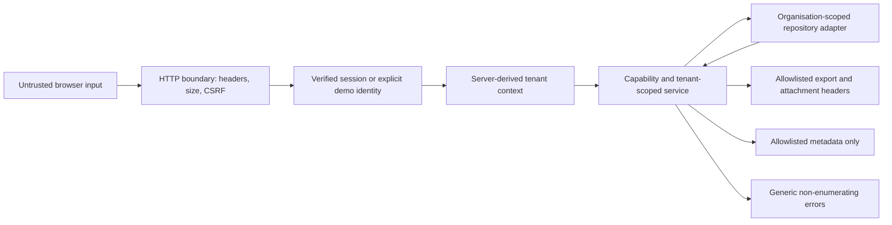

# Threat Model: Vertical Slice V1

## Status And Scope

This model covers the internal, synthetic-data-only vertical slice at baseline `7632cf2`. It is not a certification, legal opinion, penetration test, or production security assessment. Production deployment and real customer data are prohibited.

In scope are request authentication, tenant authorization, privacy export/deletion actions, audit metadata, user-controlled identifiers and filenames, local uploads/extraction/export limits, response headers, and safe errors/downloads. Production identity, hosting, key management, backups, external AI providers, and operational incident response remain blockers.

## Security Objectives

1. An actor can access only resources belonging to the organisation in their verified session context.
2. Client-supplied organisation, actor, or role fields never establish authority.
3. Missing, foreign, and unauthorized identifiers return the same non-enumerating response.
4. Demo identity is explicit in development/test and makes production configuration fail at startup.
5. State-changing cookie-authenticated requests require CSRF verification.
6. Audit and operational records contain identifiers and bounded outcome metadata, not raw transcript, address, media, signed URL, filename, prompt, or provider payload content.
7. Project export is same-tenant, attachment-only, size/rate bounded, and excludes internal object keys.
8. Deletion requires an owner, explicit consequence acknowledgement, and the exact confirmation phrase. Immediate deletion is demo-only.

## Assets

- Organisation membership and role assignments.
- Customer/project metadata and explicit measurements.
- Transcript, photo/audio metadata, private object keys, and future media bytes.
- Approved price-book and quotation data owned by other workstreams.
- Human approvals, generated exports, deletion requests, and audit history.
- Session and CSRF tokens.
- Error, audit, and operational logs.

## Actors And Assumptions

- An unauthenticated network client is hostile.
- An authenticated member may try to read or alter another organisation's resources.
- Transcript, OCR, captions, filenames, route IDs, JSON bodies, model output, and request headers are hostile data.
- A repository or identity adapter may be implemented incorrectly; the security layer therefore rechecks returned tenant ownership and session identity.
- The deterministic fake AI and synthetic fixtures are trusted code, but their content is still treated as data.
- A local developer controls the development machine. Host compromise is not mitigated by this slice.

## Trust Boundaries

The browser-to-server boundary is untrusted. Session verification and active-membership lookup establish the actor, organisation, and role. A request body cannot replace those values. Repository methods receive the trusted organisation ID, and returned records are checked again before use.

## Threats And Controls

| Threat                                          | Impact                                         | Implemented control                                                                                             | Evidence                                                       |
| ----------------------------------------------- | ---------------------------------------------- | --------------------------------------------------------------------------------------------------------------- | -------------------------------------------------------------- |
| Client changes `organisationId`, actor, or role | Cross-tenant access / mass assignment          | Unknown keys rejected; central context uses verified identity and active membership                             | `packages/security/tests/privacy.test.ts` mass-assignment case |
| Actor requests another tenant's known ID        | Horizontal escalation                          | Organisation-scoped repository query plus returned-resource tenant recheck                                      | Context and privacy negative suites                            |
| Actor probes random IDs                         | Resource enumeration                           | Missing, foreign, and unauthorized resources share `FORBIDDEN_OR_NOT_FOUND` and one German message              | Enumeration tests                                              |
| Repository returns a foreign row                | Cross-tenant disclosure despite adapter defect | Independent `assertTenantResource` and aggregate relationship checks                                            | Wrong-tenant adapter test                                      |
| Demo auth enabled in production                 | Authentication bypass                          | Configuration hard-fail for production plus explicit request header in development/test                         | Production demo-auth test                                      |
| Cross-site state-changing request               | Unauthorized mutation                          | `__Host-` session/CSRF cookies, `SameSite`, `Secure`, double-submit header comparison                           | CSRF/cookie tests                                              |
| Malicious filename or content type              | Header injection, traversal, active download   | Filename normalization, CRLF/path removal, fixed MIME-extension mapping, attachment-only disposition, `nosniff` | HTTP security tests                                            |
| Raw transcript/address/media reaches logs       | Sensitive-data disclosure                      | Event-specific audit allowlist, token-shaped string policy, operational log allowlist                           | Raw-content absence tests                                      |
| Oversized or deeply nested input                | Memory/CPU exhaustion                          | Per-action byte policies and bounded JSON validation helpers                                                    | Abuse-control tests                                            |
| High-frequency extraction/export/deletion       | Local resource exhaustion                      | Tenant/actor/session/action keyed fixed-window limiter                                                          | Rate-limit tests                                               |
| Deletion of another tenant or by non-owner      | Destructive authorization failure              | Owner capability, tenant-scoped request lookup, actor/request/project binding                                   | Privacy deletion tests                                         |
| Immediate deletion outside demo mode            | Irreversible production data loss              | Service hard-stop when `demoMode` is false                                                                      | Non-demo deletion test                                         |
| Transcript prompt injection                     | Control-flow manipulation                      | Transcript is present only in the user export data section and cannot enter audit/log control metadata          | Export and audit tests                                         |

## Abuse And Size Policy

These values are suitable for the local slice and are not production capacity claims.

| Action              |                      Maximum body/artifact | Requests/window |
| ------------------- | -----------------------------------------: | --------------: |
| Upload              | 20 MiB per validated request/file boundary |       20/minute |
| Extraction input    |                                    256 KiB |       10/minute |
| Offer export        |                                     10 MiB |       10/minute |
| Project data export |                                     10 MiB |    5/15 minutes |
| Deletion action     |                                     16 KiB |    5/15 minutes |

The in-memory limiter is process-local and loses state on restart. A production deployment requires a shared atomic limiter, trusted proxy/client handling, endpoint-specific concurrency limits, and capacity testing.

## Deletion And Export Boundaries

- Project export contains explicitly selected user/project fields. Transcript text belongs in the user's requested export but never in audit/log metadata.
- Object-storage keys, signed URLs, internal prompts, provider payloads, and arbitrary audit metadata are excluded.
- An owner creates a `CONFIRMED` deletion request only after acknowledging consequences and entering `PROJEKT LÖSCHEN` exactly.
- Direct execution is available only in demo context. The persistence adapter must delete project-owned data atomically and return a `COMPLETED` request.
- The minimal deletion audit event records request ID, status, and outcome only. It does not preserve deleted content.

## Accepted Risks For The Internal Slice

- Local process memory and files inherit workstation security and are not encrypted by this slice.
- Rate limiting is single-process and not resistant to distributed abuse.
- Security headers are builders until the coordinator wires them into every web response.
- Session verification is an interface; no production identity provider is supplied.
- CSRF tokens are generated/transported by the integrating server boundary; this package validates and serializes them.
- No browser penetration test, dependency CI gate, backup deletion proof, or hosting-region assurance is included in T08 scope.

The production blockers are maintained in `docs/security/PRODUCTION_BLOCKERS.md` and must not be reclassified as minor launch tasks.
